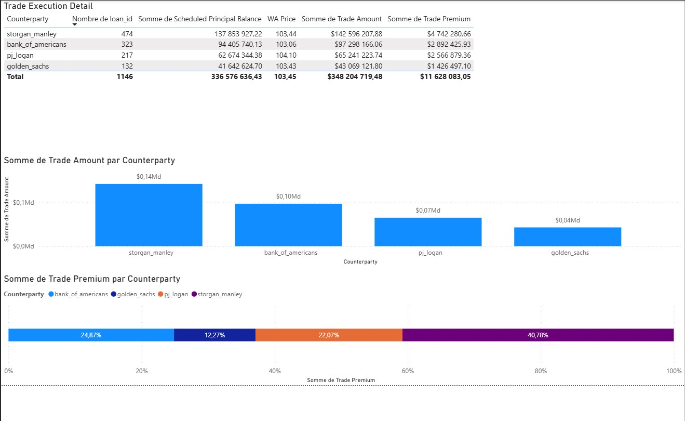

# 💼 Power BI Case Study – Mortgage Trading Analysis
)

## 🧠 Context

As a newly hired junior trader on the mortgage trading desk of a lending firm, you're responsible for managing the flow of capital from institutional investors to individual borrowers. This simulation reflects the real-world dynamics of the **mortgage-backed securities (MBS)** market, where identifying and evaluating trade opportunities is critical to maintaining profitability and risk control.

In this case study, you're tasked with analyzing a portfolio of mortgage loans, assessing bids from investors, and executing trades that balance revenue with risk exposure.

## ✅ Solution

Using **Power BI**, this project includes:

- **Data integration** and transformation of mortgage datasets using Power Query
- **Data modeling** to structure loan, bid, and trading information effectively
- Development of **DAX measures** to evaluate loan quality, bid performance, and profitability
- Building **interactive dashboards** to:
  - Segment and filter mortgages
  - Compare investor bids
  - Identify optimal trades

The report simulates the trading decision-making process and provides an interface to evaluate performance in real time.

## 📈 Result

- Developed a mortgage trading dashboard that enables:
  - Selection of mortgage populations based on key attributes (e.g., interest rate, term, risk level)
  - Evaluation of incoming bids from investors
  - Execution of trades based on data-driven insights

- Improved understanding of:
  - Capital flow from investment banks to consumers
  - Mortgage trading mechanics and risk management
  - Financial analysis using Power BI

- Strengthened practical skills in **data modeling**, **DAX**, and **financial analytics** within a real-world context

## 🛠 Tools & Technologies

- Power BI Desktop  
- Power Query Editor  
- DAX (Data Analysis Expressions)  
- Financial Analysis & Modeling  
- Mortgage Loan Data

## 📁 Dataset

The dataset simulates mortgage loan records and investor bid offers. It includes:

- Loan-level details (e.g., rate, term, credit score)  
- Investor bids with associated terms and values  
- Trade execution metrics

## 📎 How to Use

1. Open the `.pbix` file in Power BI Desktop  
2. Explore each report page and visual filter  
3. Analyze mortgage bids and trade options  
4. Review DAX measures and underlying data model  
5. Simulate your own trading decisions by interacting with filters

---

**Author**: Gael Mukendi Kabongo 
**LinkedIn**: [My LinkedIn]([https://linkedin.com/in/yourprofile](https://www.linkedin.com/in/gael-mukendi-kabongo/))  
**Email**: gmka98@gmail.com
